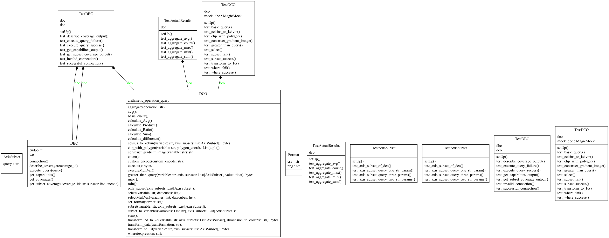
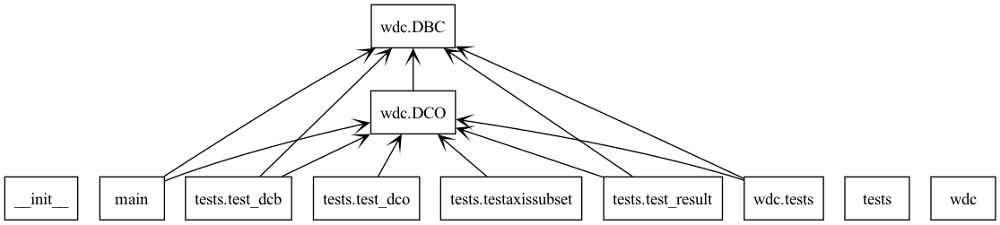

# WCPS library

## General setting

Our tasks is to make an effective and convinient WCPS qeuery generator using functionality in Python. It is basically a Python library for this purpose. We can already imagine that we will need to pass certain parameters into relevant methods of some datacube object which should then send the composed qeueries to the provided server [Rasmadan](https://ows.rasdaman.org/) where they will be processed and returned.


In order for our library to work we will be needing the following imports:

```
from DBC import DBC
from DCO import DCO, AxisSubset
from matplotlib import pyplot as plt
from matplotlib import colors
import numpy as np
import netCDF4 as nc
from IPython.display import display
from PIL import Image

import requests
from owslib.wcs import WebCoverageService
from owslib.wcs import wcs201

import io

import urllib3

urllib3.disable_warnings()
```

## Documentation
The initial documentation can be found here [initial documentation](docs.ipynb)

# General description

## Main features

- WCPS query generation: queries automatically get generated from the code
- Datacube operations: enable data manipulation task directly via Python, while also implementing the basic aggregation, processing and encoding operations
- Datacube Connection Object: created in order to manage the connections with the WCPS server

## Connecting to the server

One of the first things that were implemented was the server connection as it is crucial in order to use the wdc library. This connection was done through the DBC (database connection) class, by providing the URL of the server during the initialization of the class. 

`self.endpoint = "https://ows.rasdaman.org/rasdaman/ows"`

## DCO Class

DCO class that can communicate with the WCPS server using the provided [URL](https://ows.rasdaman.org/rasdaman/ows). With this class, the user can: 
1. Create WCPS queries using a specified variable name. 
2. Modify the Datacube object's internal state based on the returned data from the queries. 
3. Perform various operations on the datacube such data access, subsetting, aggregation, and processing.

### Functionalities

- Accessing data: Allows retrieval of datacube slices or individual elements based on specific geographic coordinates or time intervals.
- Subsetting: Facilitates the extraction of a subset of the datacube based on specified spatial dimensions or time ranges. 
- Multiple query types
    - aggregation queries (min, max, count, sum, avg)
    - multivariable queries (queries involving variables from different coverages)
    - conditional queries (queries with WHERE condition)
    - subsetting queries (queries allowing the choice of axes limits of a coverage)
- Connection and requests to the Rasdaman server 
- Data encoding (encoding results and data cubes into different formats)
- Visual display of responses from server

### Test methods

Each method tests a specific type of data retrieval operation by sending queries through the datacube object and asserting expected results against outcomes from the WCPS server.

```
    def test_successful_connection(self):
        #tests the successful connection to the server
        response=self.dbc.connection()
        self.assertEqual(response.status_code, 200)

    def test_invalid_connection(self):
        #tests error handling for invalid url
        invalid="https://os.rasdamn.org/rasdamn/ows"
        self.dbc=DBC(invalid)
        with self.assertRaises(requests.RequestException):
            self.dbc.connection()

    def test_execute_query_failure(self):
        #tests error handling for invalid query
        invalid_query='notaquery'
        response=self.dbc.execute_query(invalid_query)
        self.assertIsNone(response)

    def test_aggregate_sum(self):
        self.dco.select("$c", ["AvgLandTemp"])
        self.dco.subset(variable="$c", 
                      axis_subsets=[AxisSubset('ansi', '2013-07', '2015-04'),
                                    AxisSubset('Lat', 54.08),
                                    AxisSubset('Long', 8.80)])

        sum_res = self.dco.sum().execute()
        self.assertEqual(sum_res, b'253.34645688533783')
```


### How to run test cases
We ran our tests modularly from the terminal using `python -m tests.test_dcb`, `python -m tests.test_dco`, `python -m tests.test_result` and `tests.tesaxissubset`.


## Intstallation

To install the library locally use "pip install ." in the terminal after running the file datacube.

## UML diagrams




# Authors
- [Ana-Maria Dobrescu](https://github.com/dobreasca)
- [Thanh Nguyen](https://github.com/iamthienthanh)

